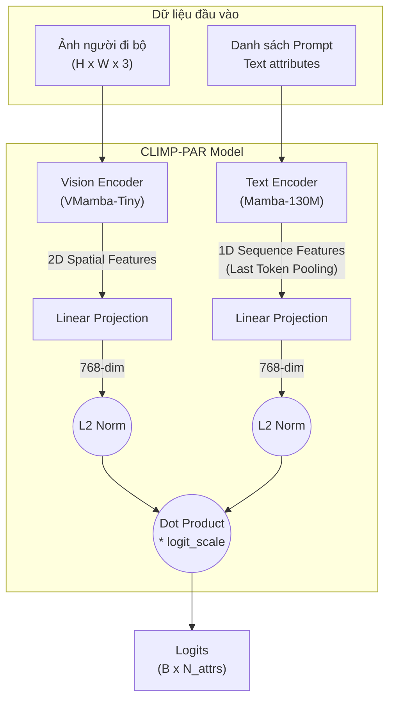

# Tổng quan Kiến trúc CLIMP-PAR

Tài liệu này trình bày chi tiết kiến trúc mô hình **CLIMP-PAR** dành cho bài toán nhận diện thuộc tính người đi bộ (Pedestrian Attribute Recognition - PAR). Mô hình kế thừa triết lý học đối sánh ngôn ngữ - hình ảnh (Contrastive Language-Image Pretraining - CLIP) nhưng thay thế hoàn toàn bộ khung (backbone) bằng các mô hình Không gian trạng thái (State Space Models - SSM/Mamba) nhằm đạt được sự cân bằng tối ưu giữa hiệu năng và chi phí tính toán.

---

## 1. Kiến trúc Tổng thể (High-level Architecture)

Kiến trúc mạng là mô hình hai luồng (Two-stream Network) độc lập:
1. **Luồng Hình ảnh (Vision Stream):** Xử lý ảnh crop của người đi bộ.
2. **Luồng Văn bản (Text Stream):** Xử lý các câu prompt mô tả thuộc tính.

Cả hai luồng chiếu (project) đặc trưng về chung một không gian nhúng có số chiều là `embed_dim` (mặc định = 768). Cuối cùng, độ tương đồng cosine giữa chúng được sử dụng làm logits cho phân loại đa nhãn.

---

## 2. Chi tiết Thành phần (Components)

### 2.1. Vision Encoder (VMamba)
- **Mô hình cốt lõi:** VMamba (Sử dụng cơ chế SS2D - 2D Selective Scan).
- **Lý do chọn VMamba:** Không giống ViT sử dụng cơ chế Self-Attention có độ phức tạp $O(N^2)$, VMamba dùng cơ chế quét cross-scan 4 hướng để đạt được Receptive Field toàn cục với độ phức tạp tính toán tuyến tính $O(N)$. Điều này giúp mô hình trích xuất đặc trưng không gian mạnh mẽ nhưng tốn ít VRAM, hỗ trợ tốt ảnh độ phân giải cao.
- **Biến đổi Dữ liệu (Transforms):** 
  - Ảnh đầu vào thường có tỉ lệ đứng (ví dụ 256x128). Mô hình áp dụng `PadToSquare` (chèn viền đen) trước khi resize, đảm bảo cấu trúc hình học cơ thể người không bị bóp méo (như khi resize trực tiếp).
- **Luồng xử lý:** 
  1. Đưa ảnh qua Patch Embedding và các VSS blocks (Hierarchical structure).
  2. Bỏ qua classification head gốc của VMamba.
  3. Áp dụng `AdaptiveAvgPool2d` và Flatten.
  4. Đưa qua `LayerNorm` và `Linear Projection` để thu được Vector Ảnh 768 chiều.

### 2.2. Text Encoder (Mamba LLM)
- **Mô hình cốt lõi:** Mamba (Pretrained trên text, ví dụ: `state-spaces/mamba-130m-hf`). Tokenizer GPT-NeoX-20B.
- **Cách thức hoạt động:**
  1. **Tạo Prompts:** Mỗi thuộc tính (ví dụ: `hat`) được đặt vào một prompt mẫu: *"a photo of a pedestrian with hat"*.
  2. **Trích xuất đặc trưng (Last-token Pooling):** Không giống BERT dùng token `[CLS]`, Mamba là mô hình tự hồi quy (causal autoregressive). Do đó, token không phải padding cuối cùng là nơi duy nhất tổng hợp toàn bộ ngữ cảnh của câu. Ta trích xuất hidden state tại vị trí token cuối cùng này.
  3. Đưa qua `LayerNorm` và `Linear Projection` để thu được Vector Văn bản 768 chiều.

### 2.3. Căn chỉnh Tương đồng (Similarity Alignment)
- Các vector đặc trưng từ Image và Text được chuẩn hóa L2 (`F.normalize(dim=-1)`).
- Tính tích vô hướng (Dot Product) giữa chúng để đo độ tương đồng Cosine.
- Tích được nhân với `logit_scale` (một tham số tự động học, tương đương với $1 / \tau$ của Softmax temperature).
- Kết quả thu được là ma trận Logits với kích thước `[Batch_size, Số_lượng_thuộc_tính]`.

---

## 3. Quá trình Huấn luyện (Training Pipeline)

### 3.1. Loss Function (Hàm mất mát)
- Trái với CLIP nguyên bản (đối sánh 1-1, dùng InfoNCE / CrossEntropy 2 chiều), **PAR là một bài toán phân loại đa nhãn (Multi-label Classification)** — một người có thể cùng lúc thỏa mãn nhiều thuộc tính.
- Do đó, CLIMP-PAR sử dụng **Binary Cross Entropy with Logits (BCE)**. Mỗi ô trong ma trận logits tương ứng với bài toán phân loại nhị phân độc lập.
- Có hỗ trợ **Weighted BCE**: Trọng số `pos_weight` được đưa vào để phạt nặng hơn nếu mô hình đoán sai các thuộc tính cực hiếm (imbalanced dataset).

### 3.2. Chiến lược Tối ưu Huấn luyện (cho Kaggle 2× T4 GPUs)
Để có thể huấn luyện hiệu quả mô hình Mamba (vốn khá nặng) trên nền tảng Kaggle có 2 GPU T4 (mỗi GPU 16GB VRAM), các tinh chỉnh sau được áp dụng:

1. **Text Feature Caching (Lưu trữ đệm vector văn bản):** 
   - Vì câu prompt của các thuộc tính không bao giờ thay đổi, việc chạy Text Encoder lặp đi lặp lại ở mỗi batch ảnh là vô cùng lãng phí.
   - Toàn bộ vector đặc trưng văn bản của tất cả các thuộc tính sẽ được tính toán 1 lần duy nhất đầu mỗi epoch và lưu lại (cache) trên GPU.
   - Lúc train, ta chỉ cần gọi `model(images, cached_text_features=text_features)` để chạy mỗi Vision Encoder, giảm >40% thời gian chạy và tiết kiệm bộ nhớ cực lớn.
2. **Kích hoạt DDP đúng chuẩn:** Việc dùng `cached_text_features` vẫn được đưa thẳng vào luồng `forward` của lớp bọc `DistributedDataParallel (DDP)` nhằm đảm bảo PyTorch tự động đồng bộ Gradient giữa 2 GPUs.
3. **Automatic Mixed Precision (AMP):** Kích hoạt fp16 bằng `autocast` và `GradScaler` để giảm thiểu việc dùng VRAM.
4. **Gradient Accumulation:** Tích lũy gradients qua N batch (ví dụ `grad_accum_steps=2`) rồi mới cập nhật trọng số. Điều này giúp nâng cao Batch Size thực tế (Effective Batch Size) lên mà không làm Out Of Memory (OOM).
