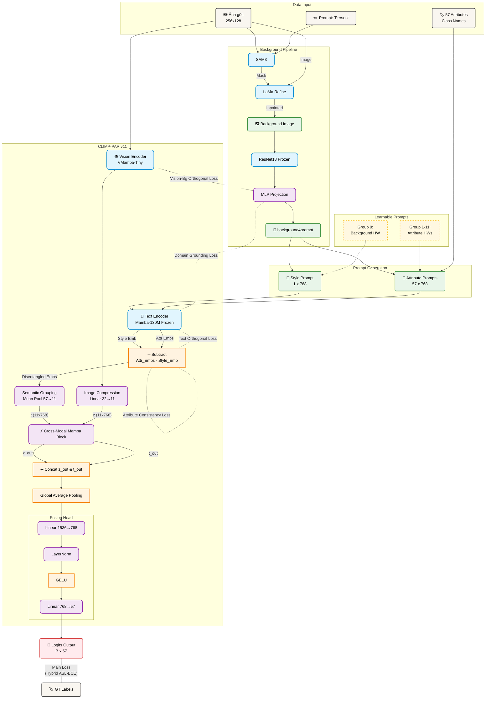

# Tổng quan Kiến trúc CLIMP-PAR v11

Tài liệu này trình bày chi tiết kiến trúc mô hình **CLIMP-PAR v11** dành cho bài toán nhận diện thuộc tính người đi bộ (Pedestrian Attribute Recognition). Phiên bản v11 bổ sung **Background Extraction & Prompting** (trích xuất domain context từ background), **Hidden Words** (12 nhóm learnable prompt tokens), và **Disentanglement** (phép trừ Style Embedding) để loại bỏ ảnh hưởng domain bias lên attribute features.

---

## 1. Kiến trúc Tổng thể (High-level Architecture)



---

## 2. Chi tiết các Thành phần Mạng (Detailed Components)

### 2.1. Background Extraction & Prompting

#### 2.1.1. Pipeline Offline (SAM3 → LaMa)
- **Mục đích:** Tách người đi bộ ra khỏi ảnh, chỉ giữ lại background.
- **SAM3 (Segment Anything Model 3):** Nhận prompt `"Person"` và ảnh gốc, tạo mask vùng người đi bộ.
- **Phép trừ ảnh:** Loại bỏ vùng người khỏi ảnh gốc (Image − Mask).
- **LaMa Refine:** Inpainting vùng bị xóa → ảnh background hoàn chỉnh, tự nhiên.
- **Lưu ý:** Pipeline này chạy **offline** — ảnh background được xử lý trước và lưu sẵn trong thư mục `domain_noper_images_inpainted_refined/`.

#### 2.1.2. Background Encoder (Online)
- **Module:** `model/background_encoder.py` → class `BackgroundEncoder`
- **Kiến trúc:** `ResNet18(frozen)` → `MLP(Linear(512, 768) + LayerNorm + GELU)`
- **Input:** Ảnh background inpainted `(B, 3, 256, 128)`
- **Output:** `background4prompt` — vector domain context `(B, 768)`
- **ResNet18 pretrained:** Sử dụng checkpoint `resnet18_background_best.pth` (đã train phân loại background).
- **Freeze:** ResNet18 backbone được **đóng băng**, chỉ MLP projection là learnable.

### 2.2. Hidden Words — 12 Nhóm Learnable Prompt Tokens
- **Module:** `model/hidden_words.py` → class `HiddenWords`
- **Cảm hứng:** CoOp (Context Optimization) — thay prompt cố định bằng token có thể học.
- **Cấu trúc:** 12 nhóm × 4 tokens × 768 dims = **36,864 learnable parameters**
  - **Group 0** (Background HW): Dùng trong Style Prompt để encode style/domain chung.
  - **Groups 1-11** (Attribute HWs): 11 nhóm ngữ nghĩa, mỗi nhóm ứng với ~5 thuộc tính.
- **Ánh xạ thuộc tính:** 57 thuộc tính được phân vào 11 Semantic Groups (nhóm ngữ nghĩa) theo logic matching (chính xác hoặc một phần), cụ thể như sau:
  
  | Nhóm | Attribute Group | Details (Từ khóa) |
  |:---:|:---|:---|
  | 1 | Gender | Female |
  | 2 | Age | Child, Adult, Elderly |
  | 3 | Body Size | Fat, Normal, Thin |
  | 4 | Viewpoint | Front, Back, Side |
  | 5 | Head | Bald, Long Hair, Black Hair, Hat, Glasses, Mask, Helmet, Scarf, Gloves |
  | 6 | Upper Body | Short Sleeves, Long Sleeves, Shirt, Jacket, Suit, Vest, Cotton Coat, Coat, Graduation Gown, Chef Uniform |
  | 7 | Lower Body | Trousers, Shorts, Jeans, Long Skirt, Short Skirt, Dress |
  | 8 | Shoes | Leather Shoes, Casual Shoes, Boots, Sandals, Other Shoes |
  | 9 | Bag | Backpack, Shoulder Bag, Hand Bag, Plastic Bag, Paper Bag, Suitcase, Others |
  | 10 | Activity | Calling, Smoking, Hands Back, Arms Crossed |
  | 11 | Posture | Walking, Running, Standing, Bicycle, Scooter, Skateboard |


### 2.3. Prompt Generator
- **Module:** `model/prompt_generator.py` → class `PromptGenerator`
- **Tạo 2 loại prompt:**
  1. **Style Prompt:** `[background4prompt] + [HW_group0_tokens]` → 1 sequence duy nhất.
  2. **57 Attribute Prompts:** `[background4prompt] + [HW_group_k_tokens] + [attr_name_word_embeds]` — mỗi prompt ứng với 1 thuộc tính.
- **Mã hóa:** Cả 2 loại prompt được đưa qua Text Encoder (Mamba backbone frozen, last-token pooling).
- **Output:** `style_emb (B, 768)` và `attr_embs (B, 57, 768)`.

### 2.4. Disentanglement
- **Phép trừ:** `disentangled = attr_embs − style_emb`
- **Mục đích:** Loại bỏ thông tin domain/background ra khỏi attribute embeddings.
- **Kết quả:** `disentangled_embeds (B, 57, 768)` — chỉ chứa thông tin thuộc tính, không bị "nhiễm" bởi background.

### 2.5. Vision Encoder (VMamba-Tiny & Adaptive Spatial Pooling)
- **Backbone:** VMamba-Tiny (SS2D — 2D Selective Scan, O(N) complexity).
- **Adaptive Pooling:** `AdaptiveAvgPool2d(8, 4)` → 32 spatial vision tokens.
- **Output:** `z (B, 32, 768)`.

### 2.6. Text Encoder (Mamba-130M)  
- **Backbone:** Mamba-130M (`state-spaces/mamba-130m-hf`), **frozen** (đóng băng hoàn toàn).
- **Phương thức mới:** `encode_from_embeddings()` — nhận pre-built embedding sequences (từ PromptGenerator) thay vì token IDs.
- **Gradient flow:** Mặc dù backbone frozen, gradients vẫn chảy ngược qua nó để cập nhật Hidden Words và Background MLP.

### 2.7. Cross-Modal Fusion & MLP Head
- **Semantic Grouping (Text):** Tự động gom nhóm (Mean Pooling) 57 attribute embeddings đã khử rối thành **11 tokens** đại diện cho 11 cụm ngữ nghĩa (Gender, Age, Shoes...).
- **Image Compression:** `Linear(32, 11)` — Bóp 32 spatial patches của ảnh xuống thành **11 tokens** để đối chiếu (align) 1:1 hoàn hảo với Text.
- **Cross-Modal Mamba Block:** 2 nhánh SSM độc lập với Shared Gate. Xử lý đầu vào là `(B, 11, 768)` ở cả 2 nhánh.
- **Fusion:** `Concat(z_out, t_out)` → `GAP` → `MLP(1536 → 768 → 57)`. GAP sẽ lấy trung bình 11 nhóm ngữ nghĩa để sinh ra một global vector.
- **Output:** `logits (B, 57)`.

---

## 3. Quá trình Huấn luyện (Training Pipeline)

### 3.1. Learnable vs Frozen Parameters
| Component | Trainable? | Số params ước lượng |
|-----------|-----------|---------------------|
| VMamba-Tiny backbone | ✅ (toàn bộ hoặc một phần) | ~20M |
| Mamba-130M backbone | ❌ Frozen | ~130M |
| Mamba Projection + Norm | ✅ | ~1.2M |
| ResNet18 backbone | ❌ Frozen | ~11M |
| Background MLP | ✅ | ~0.4M |
| Hidden Words (12 groups) | ✅ | ~0.04M |
| Image Compression (32→11) | ✅ | ~0.0003M |
| Cross-Modal Mamba | ✅ | ~4.7M |
| MLP Fusion Head | ✅ | ~1.2M |

### 3.2. Hàm Loss Hỗn hợp (Hybrid & Disentanglement Loss)
Để cân bằng giữa việc học phân loại thuộc tính và bắt buộc mạng lưới tuân theo thiết kế "khử tạp chất domain", kiến trúc sử dụng 2 nhóm hàm Loss:

**1. Main Loss (Phân loại đa nhãn):**
- **Hybrid ASL + BCE (`hybrid_asl_bce`):** Kết hợp giữa **Asymmetric Loss (ASL)** (giải quyết triệt để mất cân bằng dữ liệu giữa Negative/Positive) và **BCE Loss**.

**2. Disentanglement Loss (Ép buộc Triết lý tách Domain - Trọng số 0.5):**
Nhóm Loss phụ trợ này đảm bảo tính Symmetrical Disentanglement (Khử rối đối xứng ở cả nhánh Text và nhánh Vision):
- **Attribute Consistency Loss:** Ép phương sai của `disentangled` (của cùng một thuộc tính) dọc theo chiều Batch tiến về 0. Đảm bảo thuộc tính nguyên chất hoàn toàn miễn nhiễm với sự thay đổi của background.
- **Domain Grounding Loss:** Ép `style_emb` phải có độ tương đồng Cosine cao với `bg_context`. Đảm bảo vector Style không bị biến chất mà thực sự đại diện cho môi trường.
- **Text Orthogonal Loss:** Ép `disentangled` và `style_emb` phải trực giao (Cosine = 0) với nhau.
- **Vision-Background Orthogonal Loss:** (MỚI bổ sung) Ép `vision_features` trực giao với `bg_context`. Buộc Vision Encoder phớt lờ background trong ảnh gốc và dồn toàn bộ sự tập trung (attention) vào vùng chứa người đi bộ (Foreground).

**Công thức tổng:**
`Total Loss = Main_Loss + 0.5 * (Loss_Cons + Loss_Ground + Loss_Text_Ortho + 0.1 * Loss_Vis_Ortho)`

### 3.3. Chiến lược Tối ưu
1. **Background Images (Offline):** Ảnh inpainted được xử lý sẵn, load song song với ảnh PAR.
2. **DDP + AMP (fp16) + Gradient Accumulation:** Giữ nguyên từ v3.
3. **AdamW + Cosine Annealing:** Chỉ optimize params có `requires_grad=True`.

---

## 4. Cấu trúc Files

```
_my_model_9/
├── config.py                       # Cấu hình (thêm background, HW fields)
├── train.py                        # Script huấn luyện v11
├── evaluate.py                     # Script đánh giá v11
├── train_background.py             # Train ResNet18 background classifier
├── losses.py                       # Hàm loss (BCE, Weighted BCE, Hybrid)
├── overview_architecture.md        # Tài liệu này
│
├── model/
│   ├── __init__.py                 # Export tất cả modules
│   ├── climp_par.py                # ★ CLIMPPAR v11 (model chính)
│   ├── vision_encoder.py           # VMamba-Tiny Vision Encoder
│   ├── text_encoder.py             # Mamba-130M Text Encoder (+ encode_from_embeddings)
│   ├── background_encoder.py       # ★ Background Encoder (ResNet18 + MLP)
│   ├── hidden_words.py             # ★ Hidden Words (12 nhóm learnable)
│   ├── prompt_generator.py         # ★ Prompt Generator (tổ hợp prompts)
│   └── cross_mamba.py              # Cross-Modal Mamba Block
│
└── dataset/
    ├── clip_dataset.py             # PARDataset (+ background image loading)
    └── prompt_templates.py         # Prompt templates (legacy, dùng cho fallback)
```

*★ = File mới hoặc thay đổi lớn trong v11*