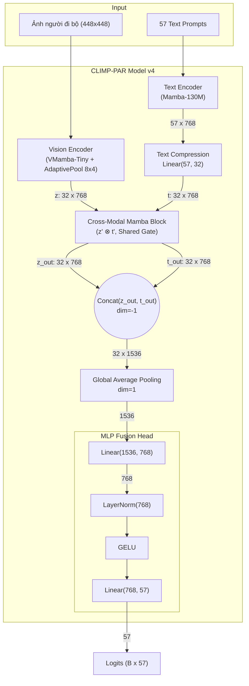

# Tổng quan Kiến trúc CLIMP-PAR v4

Tài liệu này trình bày chi tiết kiến trúc mô hình **CLIMP-PAR v4** dành cho bài toán nhận diện thuộc tính người đi bộ (Pedestrian Attribute Recognition). Phiên bản này nâng cấp độ phân giải ảnh lên **$448 \times 448$** (sử dụng pipeline `PadToFixedSize`), bổ sung cơ chế **Adaptive Spatial Pooling ($8 \times 4$)** trong **VMamba Vision Encoder**, kết hợp cùng **Cross-Modal Mamba Block** (Gating chéo chia sẻ) và nén chuỗi văn bản (Sequence Compression).

---

## 1. Kiến trúc Tổng thể (High-level Architecture)

Kiến trúc mạng là mô hình hai luồng (Two-stream Network) với một khối Cross-Modal Mamba dung hợp ở cuối:
1. **Luồng Hình ảnh (Vision Stream):** Xử lý ảnh crop của người đi bộ với độ phân giải cao $448 \times 448$. Ảnh đi qua backbone **VMamba-Tiny**, sau đó feature map ($14 \times 14$) được nén linh hoạt bằng `AdaptiveAvgPool2d(8, 4)` về $8 \times 4$, xuất ra **32 spatial vision tokens** (kích thước $32 \times 768$).
2. **Luồng Văn bản (Text Stream):** Xử lý 57 câu prompt mô tả thuộc tính qua Mamba LLM (`state-spaces/mamba-130m-hf`). Khối này xuất ra 57 token ($57 \times 768$) và sau đó được **nén tuyến tính về 32 token** ($32 \times 768$) để khớp với luồng hình ảnh.

Sau khi đồng bộ kích thước (32 token cho mỗi luồng), cả hai luồng được đẩy vào **Cross-Modal Mamba Block**. Ở khối này, một "Gate chia sẻ" được sinh ra từ tích Element-wise của 2 luồng, giúp hai luồng giao thoa thông tin ở mức token.

Cuối cùng, đặc trưng của hai luồng được nối lại (Concat), gộp toàn cục (Global Average Pooling) và chạy qua **MLP Fusion Head** để xuất ra 57 logits.

---

## 2. Chi tiết các Thành phần Mạng (Detailed Components)

### 2.1. Vision Encoder (VMamba-Tiny & Adaptive Spatial Pooling)
- **Mô hình cốt lõi:** VMamba-Tiny (Sử dụng cơ chế SS2D - 2D Selective Scan).
- **Lý do chọn VMamba:** Không giống ViT sử dụng cơ chế Self-Attention có độ phức tạp $O(N^2)$, VMamba dùng cơ chế quét cross-scan 4 hướng để đạt được Receptive Field toàn cục với độ phức tạp tính toán tuyến tính $O(N)$. Điều này giúp mô hình trích xuất đặc trưng không gian mạnh mẽ nhưng tốn ít VRAM, hỗ trợ rất tốt ảnh độ phân giải cao $448 \times 448$.
- **Biến đổi Dữ liệu (Transforms):** 
  - Ảnh đầu vào được xử lý qua `PadToFixedSize(448, 448)`. Nếu ảnh lớn hơn khung, hàm `thumbnail` thu nhỏ giữ nguyên tỷ lệ; sau đó bổ sung viền đen padding xung quanh để đưa về ảnh cố định $448 \times 448$ mà không làm méo tỷ lệ cơ thể người đi bộ hay biến dạng pixel (thay vì dùng `PadToSquare` + `Resize` ép tỷ lệ).
- **Luồng xử lý chi tiết trong `VisionEncoder`:** 
  1. Đưa ảnh `(B, 3, 448, 448)` qua Patch Embedding và các VSS blocks (Hierarchical structure).
  2. Kết quả feature map đầu ra từ backbone có kích thước $(B, C, 14, 14)$ (với downsample factor 32×).
  3. Áp dụng `nn.functional.adaptive_avg_pool2d(x, (8, 4))` để nén bản đồ đặc trưng về dạng $8 \times 4$ ($32$ spatial patches), đảm bảo giữ đúng 32 vision tokens bất kể kích thước ảnh đầu vào.
  4. Flatten & Transpose thành `(B, 32, C)`.
  5. Đưa qua `LayerNorm` và `Linear Projection` để thu được tập hợp 32 vision tokens `(B, 32, 768)`.

### 2.2. Text Encoder (Mamba LLM) & Compression
- **Mô hình cốt lõi:** Mamba LLM (ví dụ: `state-spaces/mamba-130m-hf`) cùng Tokenizer GPT-NeoX-20B.
- **Luồng xử lý:**
  1. **Tạo Prompts:** Mỗi thuộc tính trong 57 thuộc tính được đặt vào một prompt mẫu: *"a photo of a pedestrian with [attribute]"*.
  2. **Trích xuất đặc trưng (Last-token Pooling):** Do Mamba là mô hình tự hồi quy (causal autoregressive), hidden state tại vị trí token không phải padding cuối cùng chứa toàn bộ thông tin ngữ cảnh của câu prompt.
  3. **Nén Chuỗi:** Vector văn bản $57 \times 768$ được mở rộng theo batch `(B, 57, 768)`, sau đó qua lớp `nn.Linear(57, 32)` để nén 57 token xuống còn **32 text tokens** `(B, 32, 768)` đồng bộ với 32 vision tokens.

### 2.3. Cross-Modal Fusion & MLP Head
- Hai luồng đặc trưng từ Vision `(B, 32, 768)` và Text `(B, 32, 768)` được đưa vào **Cross-Modal Mamba Block**.
- Một *Shared Gate* sinh ra từ tích Element-wise của 2 luồng giúp điều hòa dòng thông tin chéo giữa hai phương tiện.
- Đầu ra $z_{out}$ và $t_{out}$ được ghép nối (Concat) theo chiều đặc trưng thành `(B, 32, 1536)`.
- Áp dụng `Global Average Pooling` (GAP) theo chiều sequence để thu gọn về tensor `(B, 1536)`.
- Đưa qua **MLP Fusion Head** (`Linear(1536, 768)` -> `LayerNorm(768)` -> `GELU` -> `Linear(768, 57)`) để tạo ra 57 logits phân loại cho 57 thuộc tính người đi bộ.

---

## 3. Quá trình Huấn luyện (Training Pipeline)

### 3.1. Loss Function (Hàm mất mát)
- Phân loại thuộc tính người đi bộ là bài toán **Multi-label Classification**.
- CLIMP-PAR v4 sử dụng **Binary Cross Entropy with Logits (BCE)**. Mỗi ô trong ma trận logits đại diện cho một bài toán phân loại nhị phân độc lập.
- Có hỗ trợ **Weighted BCE**: Sử dụng `pos_weight` phạt nặng lỗi đoán sai ở các thuộc tính xuất hiện hiếm (imbalanced dataset).

### 3.2. Chiến lược Tối ưu Huấn luyện (cho Kaggle 2× T4 GPUs)
1. **Text Feature Caching:** Vector đặc trưng văn bản của 57 thuộc tính được tính toán 1 lần duy nhất đầu mỗi epoch và lưu lại (cache) trên GPU, giảm đáng kể thời gian tính toán và tiết kiệm VRAM.
2. **Kích hoạt DDP:** Kết hợp `cached_text_features` với `DistributedDataParallel (DDP)` để PyTorch tự động đồng bộ gradient trên 2 GPUs.
3. **Automatic Mixed Precision (AMP):** Kích hoạt fp16 bằng `autocast` và `GradScaler`.
4. **Gradient Accumulation:** Tích lũy gradient qua N batch (với `batch_size=8` mỗi GPU và `grad_accum_steps=2` cho effective batch size = $8 \times 2 \times 2 = 32$).
