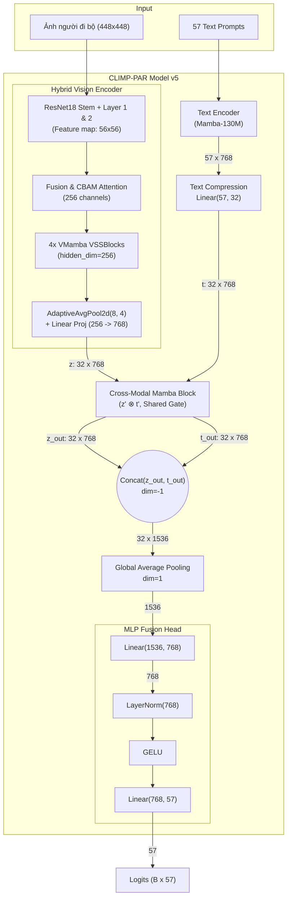

# Tổng quan Kiến trúc CLIMP-PAR v5

Tài liệu này trình bày chi tiết kiến trúc mô hình **CLIMP-PAR v5** dành cho bài toán nhận diện thuộc tính người đi bộ (Pedestrian Attribute Recognition). Phiên bản này tích hợp **Hybrid Vision Encoder (ResNet18 + CBAM + VMamba)** với độ phân giải đầu vào $448 \times 448$, kết hợp cùng **Cross-Modal Mamba Block** (Gating chéo chia sẻ) và nén chuỗi văn bản (Sequence Compression) để dung hợp hai luồng (Vision và Text) một cách tối ưu.

---

## 1. Kiến trúc Tổng thể (High-level Architecture)

Kiến trúc mạng là mô hình hai luồng (Two-stream Network) với một khối Cross-Modal Mamba dung hợp ở cuối:
1. **Luồng Hình ảnh (Hybrid Vision Stream):** Đưa ảnh người đi bộ kích thước $448 \times 448$ qua chuỗi trích xuất đặc trưng đa cấp (ResNet18 stem & lower stages -> Fusion & CBAM Attention -> 4 VSSBlocks của VMamba). Sau đó sử dụng `AdaptiveAvgPool2d(8, 4)` và `Linear Projection` để xuất ra **32 spatial vision tokens** (kích thước $32 \times 768$).
2. **Luồng Văn bản (Text Stream):** Xử lý 57 câu prompt mô tả thuộc tính qua Mamba LLM (`state-spaces/mamba-130m-hf`). Khối này xuất ra 57 token ($57 \times 768$) và sau đó được **nén tuyến tính về 32 token** ($32 \times 768$) để khớp với luồng hình ảnh.

Sau khi đồng bộ kích thước (32 token cho mỗi luồng), cả hai luồng được đẩy vào **Cross-Modal Mamba Block**. Ở khối này, một "Gate chia sẻ" được sinh ra từ tích Element-wise của 2 luồng, giúp hai phương tiện giao thoa thông tin ở mức token.

Cuối cùng, đặc trưng của hai luồng được nối lại (Concat), gộp toàn cục (Global Average Pooling) và chạy qua **MLP Fusion Head** để xuất ra 57 logits.

---

## 2. Chi tiết các Thành phần Mạng (Detailed Components)

### 2.1. Hybrid Vision Encoder (ResNet18 + CBAM + VMamba)
- **Mô hình cốt lõi:** Kết hợp khả năng trích xuất đặc trưng cục bộ (Local Features) của CNN (ResNet18), cơ chế tập trung chú ý kẹp kênh & không gian của Attention (**CBAM**), cùng khả năng mô hình hóa ngữ cảnh toàn cục (Global Context) của **VMamba (VSSBlock)**.
- **Biến đổi Dữ liệu (Transforms):** 
  - Ảnh đầu vào được xử lý qua `PadToFixedSize(448, 448)`. Nếu ảnh lớn hơn khung, hàm `thumbnail` thu nhỏ giữ nguyên tỷ lệ; sau đó bổ sung viền đen padding xung quanh để đưa về ảnh cố định $448 \times 448$ mà không làm méo tỷ lệ cơ thể người đi bộ hay biến dạng pixel.
- **Luồng xử lý chi tiết trong `HybridVisionEncoder`:** 
  1. **ResNet18 Backbone (2 Stages đầu):**
     - Ảnh đầu vào `(B, 3, 448, 448)` đi qua Stem (`conv1` -> `bn1` -> `relu` -> `maxpool`) thu được tensor `(B, 64, 112, 112)`.
     - Qua Stage 1 (`layer1`) thu được $f_1$ `(B, 64, 112, 112)`.
     - Qua Stage 2 (`layer2`) thu được $f_2$ `(B, 128, 56, 56)`.
  2. **Fusion Module:**
     - Giảm kích thước không gian của $f_1$ qua `downsample_l1` (`Conv2d(64, 128, kernel_size=3, stride=2, padding=1)`) thu được $f_{1\_down}$ `(B, 128, 56, 56)`.
     - Ghép nối kênh `torch.cat([f1_down, f2], dim=1)` thu được 256 channels, sau đó qua `fusion_conv` (`Conv1x1` -> `BatchNorm` -> `ReLU`) giữ nguyên `(B, 256, 56, 56)`.
  3. **CBAM Attention:**
     - Đưa tensor qua khối CBAM bao gồm `ChannelAttention` (Global Avg Pool & Max Pool + MLP Conv1x1 + Sigmoid) và `SpatialAttention` (Mean & Max qua kênh + Conv7x7 + Sigmoid) để lọc và nhấn mạnh đặc trưng quan trọng.
  4. **VMamba Blocks:**
     - Chuyển layout tensor từ `(B, C, H, W)` sang `(B, 56, 56, 256)` và đưa qua 4 khối `VSSBlock` (hidden_dim=256, forward_type="v0") nhằm quét ngữ cảnh toàn cục theo cơ chế State Space Model.
  5. **Pooling & Projection:**
     - Áp dụng `AdaptiveAvgPool2d((8, 4))` nén không gian $56 \times 56 \rightarrow 8 \times 4$ ($32$ patches).
     - Flatten & Transpose thành tensor `(B, 32, 256)`.
     - Chiếu tuyến tính qua `nn.Linear(256, 768)` để thu được 32 vision tokens, mỗi token 768 chiều `(B, 32, 768)`.

### 2.2. Text Encoder (Mamba LLM) & Compression
- **Mô hình cốt lõi:** Mamba LLM (ví dụ: `state-spaces/mamba-130m-hf`) cùng Tokenizer GPT-NeoX-20B.
- **Luồng xử lý:**
  1. **Tạo Prompts:** Mỗi thuộc tính trong 57 thuộc tính được đặt vào một prompt mẫu: *"a photo of a pedestrian with [attribute]"*.
  2. **Trích xuất đặc trưng (Last-token Pooling):** Do Mamba là mô hình tự hồi quy (causal autoregressive), hidden state tại vị trí token không phải padding cuối cùng chứa toàn bộ thông tin ngữ cảnh của câu prompt.
  3. **Độ mở rộng & Nén:** Vector văn bản $57 \times 768$ được mở rộng theo batch `(B, 57, 768)`, sau đó qua lớp `nn.Linear(57, 32)` để nén 57 token xuống còn **32 text tokens** `(B, 32, 768)` đồng bộ với 32 vision tokens.

### 2.3. Cross-Modal Fusion & MLP Head
- Hai luồng đặc trưng từ Vision `(B, 32, 768)` và Text `(B, 32, 768)` được đưa vào **Cross-Modal Mamba Block**.
- Một *Shared Gate* sinh ra từ tích Element-wise của 2 luồng giúp điều hòa dòng thông tin chéo giữa hai phương tiện.
- Đầu ra $z_{out}$ và $t_{out}$ được ghép nối (Concat) theo chiều đặc trưng thành `(B, 32, 1536)`.
- Áp dụng `Global Average Pooling` (GAP) theo chiều sequence để thu gọn về tensor `(B, 1536)`.
- Đưa qua **MLP Fusion Head** (`Linear(1536, 768)` -> `LayerNorm(768)` -> `GELU` -> `Linear(768, 57)`) để tạo ra 57 logits phân loại cho 57 thuộc tính người đi bộ.

---

## 3. Quá trình Huấn luyện (Training Pipeline)

### 3.1. Loss Function (Hàm mất mát)
- Phân loại thuộc tính người đi bộ là bài toán **Multi-label Classification**.
- CLIMP-PAR v5 sử dụng **Binary Cross Entropy with Logits (BCE)** (hoặc tùy chọn Asymmetric Loss - ASL). Mỗi ô trong ma trận logits đại diện cho một bài toán phân loại nhị phân độc lập.
- Có hỗ trợ **Weighted BCE**: Sử dụng `pos_weight` phạt nặng lỗi đoán sai ở các thuộc tính xuất hiện hiếm (imbalanced dataset).

### 3.2. Chiến lược Tối ưu Huấn luyện (cho Kaggle 2× T4 GPUs)
1. **Text Feature Caching:** Vector đặc trưng văn bản của 57 thuộc tính được tính toán 1 lần duy nhất đầu mỗi epoch và lưu lại (cache) trên GPU, giảm đáng kể thời gian tính toán và tiết kiệm VRAM.
2. **Kích hoạt DDP:** Kết hợp `cached_text_features` với `DistributedDataParallel (DDP)` để PyTorch tự động đồng bộ gradient trên 2 GPUs.
3. **Automatic Mixed Precision (AMP):** Kích hoạt fp16 bằng `autocast` và `GradScaler`.
4. **Gradient Accumulation:** Accumulate gradient qua N batch (ví dụ `grad_accum_steps=4` kết hợp `batch_size=8` mỗi GPU cho effective batch size = $8 \times 2 \times 4 = 64$).
