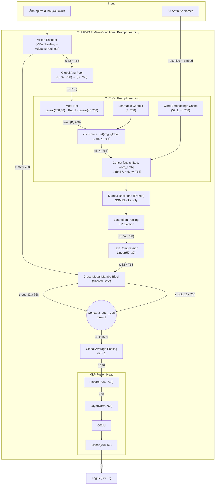

# Tổng quan Kiến trúc CLIMP-PAR v6 (CoCoOp Conditional Prompt Learning)

Tài liệu này trình bày chi tiết kiến trúc mô hình **CLIMP-PAR v6** dành cho bài toán nhận diện thuộc tính người đi bộ (Pedestrian Attribute Recognition). Phiên bản này **giữ nguyên toàn bộ kiến trúc v4** nhưng bổ sung cơ chế **Conditional Prompt Learning** theo **CoCoOp** (Conditional Context Optimization, CVPR 2022) cho nhánh text.

---

## 1. Khác biệt chính so với v4

| Thành phần | v4 (CLIMP-PAR) | v6 (+ CoCoOp) |
|---|---|---|
| **Text Prompt** | Tĩnh: prompt cố định cho mọi ảnh | **Động**: prompt thay đổi theo từng ảnh |
| **Text Features** | Cache 1 lần/epoch (tĩnh) | **Sinh online** mỗi batch (phụ thuộc ảnh) |
| **Learnable Prompts** | Không | Có: `n_ctx=4` learnable context tokens |
| **Meta-Net** | Không | Có: MLP sinh instance-conditional bias |
| **Cache** | Cache text features $(57 \times 768)$ | Cache **word embeddings** $(57 \times L_w \times 768)$ |
| **Text Backbone** | Trainable (fine-tune) | **Freeze** (chỉ train prompt + meta-net) |

---

## 2. Kiến trúc Tổng thể (High-level Architecture)

Kiến trúc mạng vẫn là mô hình hai luồng (Two-stream Network), nhưng nhánh text giờ bổ sung thêm khối **Conditional Prompt Learner**:

1. **Luồng Hình ảnh (Vision Stream):** Giữ nguyên từ v4 — Ảnh $448 \times 448$ → VMamba-Tiny → AdaptivePool $8 \times 4$ → **32 vision tokens** $(B, 32, 768)$.
2. **Global Pooling:** Vision tokens được global average pooling thành vector $(B, 768)$ để làm đầu vào cho Meta-Net.
3. **Conditional Prompt Learning (CoCoOp):**
   - **Meta-Net:** MLP nhỏ nhận global vision feature → sinh conditional bias $(B, 768)$.
   - **Learnable Context:** `n_ctx=4` token learnable, chia sẻ mọi ảnh $(4, 768)$.
   - **Shifting:** `ctx_shifted = ctx + bias` → mỗi ảnh có bộ context riêng $(B, 4, 768)$.
   - **Concat:** Nối context tokens với word embeddings đã cache → prompt embedding hoàn chỉnh.
4. **Luồng Văn bản (Text Stream):** Prompt embeddings đi qua SSM blocks (Mamba backbone, đã freeze) → last-token pooling → projection → $(B, 57, 768)$ → nén xuống $(B, 32, 768)$.
5. **Cross-Modal Mamba Block + MLP Fusion Head:** Giữ nguyên từ v4.



---

## 3. Chi tiết các Thành phần Mạng (Detailed Components)

### 3.1. Vision Encoder (VMamba-Tiny & Adaptive Spatial Pooling)
*Giữ nguyên từ v4.*
- **Mô hình cốt lõi:** VMamba-Tiny (Sử dụng cơ chế SS2D - 2D Selective Scan).
- **Biến đổi Dữ liệu:** `PadToFixedSize(448, 448)` → giữ nguyên tỷ lệ pixel.
- **Luồng xử lý:** Ảnh $(B, 3, 448, 448)$ → Patch Embedding → VSS blocks → feature map $(B, C, 14, 14)$ → `AdaptiveAvgPool2d(8, 4)` → Flatten → LayerNorm → Linear Projection → $(B, 32, 768)$.

### 3.2. Conditional Prompt Learner (CoCoOp) — **MỚI**
Đây là module chính phân biệt v6 với v4.

#### 3.2.1. Meta-Net
- **Kiến trúc:** `Linear(768, 48) → ReLU → Linear(48, 768)`
- **Đầu vào:** Global vision feature $(B, 768)$ — kết quả global average pooling của 32 vision tokens.
- **Đầu ra:** Conditional bias vector $(B, 768)$.
- **Ý nghĩa:** Mỗi ảnh sinh một bias vector riêng biệt, dùng để "dịch chuyển" learnable context tokens.

#### 3.2.2. Learnable Context Vectors
- **Shape:** $(n\_ctx, 768) = (4, 768)$ — 4 token learnable, chia sẻ mọi ảnh.
- **Khởi tạo:** Random normal với $\text{std}=0.02$.
- **Vai trò:** Đóng vai trò như "soft prompt" — các token học được trong không gian embedding, thay thế template text cứng.

#### 3.2.3. Instance-Conditional Shifting
```
ctx_shifted = learnable_ctx + meta_net(image_global)
            = (4, 768)      + (B, 1, 768)  [broadcast]
            = (B, 4, 768)
```
Mỗi ảnh có một bộ context tokens riêng, mang thông tin ngữ cảnh hình ảnh.

#### 3.2.4. Prompt Assembly
```
prompt_embedding = Concat([ctx_shifted, word_embeddings_of_attribute])
                 = Concat([(B, 4, 768), (N_attr, L_w, 768)])
                 → (B × N_attr, 4 + L_w, 768)
```
Với mỗi ảnh × mỗi thuộc tính, ta có một prompt embedding hoàn chỉnh gồm:
- 4 context tokens (instance-conditional)
- $L_w$ word embedding tokens (tĩnh, đã cache)

### 3.3. Text Encoder (Mamba LLM — Frozen) & Compression
- **Mô hình cốt lõi:** Mamba LLM (`state-spaces/mamba-130m-hf`) — **đóng băng** trong v6.
- **Luồng xử lý mới (CoCoOp):**
  1. **Word Embeddings Cache:** Chỉ lấy embeddings từ embedding layer (lookup table), KHÔNG qua SSM blocks. Cache 1 lần duy nhất.
  2. **Forward with Prompt Embeddings:** ConditionalPromptLearner tạo prompt embeddings → truyền trực tiếp vào SSM blocks (bỏ qua embedding layer) → last-token pooling → projection.
  3. **Output:** $(B, 57, 768)$ — mỗi ảnh có 57 text features riêng biệt.
  4. **Nén Chuỗi:** $57 \times 768$ → nén bằng `nn.Linear(57, 32)` → **32 text tokens** $(B, 32, 768)$.

### 3.4. Cross-Modal Fusion & MLP Head
*Giữ nguyên từ v4.*
- Hai luồng $(B, 32, 768)$ Vision + Text → **Cross-Modal Mamba Block** (Shared Gate).
- Concat → GAP → MLP Fusion Head → 57 logits.

---

## 4. Quá trình Huấn luyện (Training Pipeline)

### 4.1. Loss Function (Hàm mất mát)
*Giữ nguyên từ v4.*
- **BCE with Logits** cho multi-label classification.
- Hỗ trợ **Weighted BCE** cho imbalanced dataset.

### 4.2. Chiến lược Tối ưu Huấn luyện (cho Kaggle 2× T4 GPUs)
1. **Word Embedding Caching (MỚI v6):** Word embeddings thô được tính 1 lần duy nhất và lưu cache. Lưu ý: **text features hoàn chỉnh KHÔNG được cache** vì chúng phụ thuộc vào ảnh đầu vào (CoCoOp).
2. **Freeze Text Backbone:** Mamba backbone được đóng băng hoàn toàn. Chỉ train: Meta-Net, Learnable Context, Vision Encoder, Cross-Modal Mamba, MLP Head, Text Compression, Text Projection. Giảm VRAM và số parameters trainable.
3. **Kích hoạt DDP:** `DistributedDataParallel (DDP)` trên 2 GPUs.
4. **Automatic Mixed Precision (AMP):** fp16 bằng `autocast` và `GradScaler`.
5. **Gradient Accumulation:** Tích lũy gradient qua N batch (với `batch_size=8` mỗi GPU và `grad_accum_steps=2` cho effective batch size = $8 \times 2 \times 2 = 32$).

### 4.3. So sánh Training Cost v4 vs v6

| Yếu tố | v4 | v6 |
|---|---|---|
| Text encoder forward/batch | 0 (cached) | **1** (online, nhưng backbone frozen → chỉ forward, không backward) |
| Trainable params (text backbone) | ~33M | **0** (frozen) |
| Thêm params (CoCoOp) | 0 | ~**74K** (Meta-Net: ~73K + Context: ~3K) |
| VRAM per batch | Thấp hơn | Cao hơn một chút (online text forward) |

---

## 5. Cấu trúc Thư mục

```
_my_model_6/
├── config.py                    # Config + CoCoOp hyperparams (n_ctx, meta_net_hidden_dim)
├── losses.py                    # BCE Loss (giữ nguyên v4)
├── train.py                     # Training script (CoCoOp mode)
├── evaluate.py                  # Evaluation script (CoCoOp mode)
├── visualize.py                 # Visualization script (CoCoOp mode)
├── test_shapes.py               # Shape verification tests
├── overview_architecture.md     # Tài liệu này
├── model/
│   ├── __init__.py
│   ├── vision_encoder.py        # VMamba (giữ nguyên v4)
│   ├── text_encoder.py          # Mamba LLM + get_word_embeddings + forward_with_prompt_embeddings
│   ├── conditional_prompt.py    # ★ MỚI: MetaNet + ConditionalPromptLearner
│   ├── cross_mamba.py           # Cross-Modal Mamba Block (giữ nguyên v4)
│   └── climp_par.py             # CLIMP-PAR v6 model (tích hợp CoCoOp)
└── dataset/
    ├── clip_dataset.py          # PARDataset (giữ nguyên v4)
    └── prompt_templates.py      # Prompt templates (giữ nguyên v4)
```
