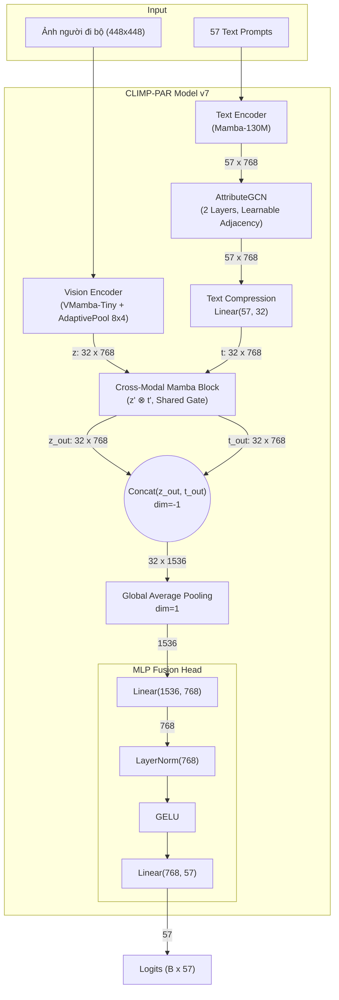

# Tổng quan Kiến trúc CLIMP-PAR v7

Tài liệu này trình bày chi tiết kiến trúc mô hình **CLIMP-PAR v7** dành cho bài toán nhận diện thuộc tính người đi bộ (Pedestrian Attribute Recognition). Phiên bản này kế thừa toàn bộ ưu điểm của **v4** (độ phân giải cao $448 \times 448$, VMamba Vision Encoder, Cross-Modal Mamba Block) nhưng **đột phá bằng việc bổ sung AttributeGCN** để học trực tiếp mối quan hệ giữa các thuộc tính, giúp mô hình suy luận tốt hơn (ví dụ: "mặc váy" thường đi kèm "nữ giới").

---

## 1. Kiến trúc Tổng thể (High-level Architecture)

Kiến trúc mạng là mô hình hai luồng (Two-stream Network) với sự giao thoa ở cuối:
1. **Luồng Hình ảnh (Vision Stream):** Xử lý ảnh crop của người đi bộ với độ phân giải cao $448 \times 448$. Ảnh đi qua backbone **VMamba-Tiny**, nén linh hoạt bằng `AdaptiveAvgPool2d(8, 4)` để xuất ra **32 spatial vision tokens** (kích thước $32 \times 768$).
2. **Luồng Văn bản (Text Stream):** Xử lý 57 câu prompt mô tả thuộc tính qua Mamba LLM (`state-spaces/mamba-130m-hf`) để tạo 57 token ($57 \times 768$). Tiếp theo, **AttributeGCN** xử lý đồ thị 57 node này để "làm giàu" đặc trưng mỗi thuộc tính dựa trên các thuộc tính khác. Cuối cùng, 57 token được nén tuyến tính về **32 text tokens** ($32 \times 768$).

Sau đó, cả hai luồng được đẩy vào **Cross-Modal Mamba Block**, nơi một "Gate chia sẻ" giúp hai luồng giao thoa thông tin. Cuối cùng, đặc trưng được ghép nối (Concat), gộp toàn cục (GAP) và qua **MLP Fusion Head** để xuất ra 57 logits.

---

## 2. Chi tiết các Thành phần Mạng (Detailed Components)

### 2.1. Vision Encoder (VMamba-Tiny & Adaptive Spatial Pooling)
- Tương tự như v4, sử dụng **VMamba-Tiny** (SS2D cross-scan) để trích xuất đặc trưng toàn cục với độ phức tạp $O(N)$, tối ưu cho ảnh $448 \times 448$.
- Dùng `PadToFixedSize(448, 448)` để giữ nguyên tỷ lệ cơ thể.
- `AdaptiveAvgPool2d(8, 4)` đảm bảo luôn xuất ra 32 vision tokens `(B, 32, 768)`.

### 2.2. Text Encoder & AttributeGCN (Điểm mới)
- **Text Encoder (Mamba LLM):** Mỗi thuộc tính đi qua prompt *"a photo of a pedestrian with [attribute]"*. Dùng last-token pooling thu được 57 attribute embeddings `(B, 57, 768)`.
- **AttributeGCN:**
  - Hoạt động trên đồ thị 57 node, mỗi node đại diện cho 1 thuộc tính.
  - Sử dụng **learnable adjacency matrix** $A_{raw}$ kích thước $57 \times 57$, được khởi tạo với giá trị lớn trên đường chéo (self-connection mạnh).
  - Quá trình xử lý: $A_{raw}$ qua hàm `sigmoid` và symmetric normalization (Kipf & Welling). Đặc trưng đi qua 2 lớp GCN với công thức $h' = h + GELU(LayerNorm(\hat{A} \cdot h \cdot W))$.
  - Result: Các token được "làm giàu" tri thức tương quan, giữ nguyên kích thước `(B, 57, 768)`.
- **Text Compression:** Dùng lớp `nn.Linear(57, 32)` để nén 57 token xuống 32 token `(B, 32, 768)`.

### 2.3. Cross-Modal Fusion & MLP Head
- Đặc trưng Vision `(B, 32, 768)` và Text (đã qua GCN và nén) `(B, 32, 768)` được đưa vào **Cross-Modal Mamba Block**.
- Một *Shared Gate* sinh ra từ tích Element-wise của 2 luồng giúp điều hòa thông tin chéo.
- Ghép nối (Concat) đầu ra thành `(B, 32, 1536)`, áp dụng GAP theo sequence, rồi đưa qua MLP Head (GELU, LayerNorm) để ra 57 logits phân loại.

---

## 3. Quá trình Huấn luyện (Training Pipeline)

- **Loss Function:** Sử dụng **Weighted BCE** để tự động phạt nặng lỗi ở các thuộc tính xuất hiện hiếm (imbalanced dataset).
- **Text Feature Caching:** Do text prompt cố định, đặc trưng văn bản có thể được tính 1 lần và cache lại. (Trong v7, Text Encoder tĩnh, nhưng AttributeGCN vẫn nhận gradient từ phần sau).
- **Tối ưu Multi-GPU:** Tích hợp `DistributedDataParallel (DDP)` cho 2× T4 GPUs.
- **AMP & Gradient Accumulation:** Kích hoạt `autocast` fp16 và tích lũy gradient 2 step (effective batch size 32 trên 2 GPU) để vượt qua giới hạn VRAM 16GB.
