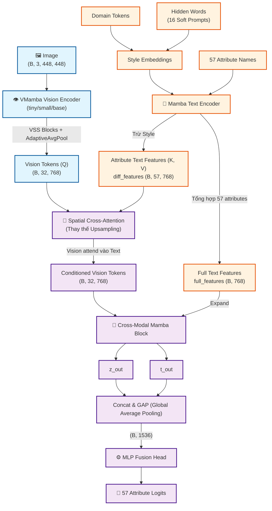

# Kiến trúc Mô hình CLIMP-PAR (v8.1)

Dựa trên mã nguồn, dưới đây là bản tóm tắt chi tiết về kiến trúc của mô hình **CLIMP-PAR (phiên bản v8.1)** dành cho bài toán Nhận dạng thuộc tính người đi bộ (Pedestrian Attribute Recognition - PAR).

Mô hình là sự kết hợp đa phương thức (multimodal) giữa hai nhánh: Vision (Hình ảnh) và Text (Văn bản), sử dụng các khối Mamba và Cross-Attention để trích xuất và kết hợp đặc trưng.

## 1. Nhánh Thị giác (Vision Branch) - `VMambaVisionEncoder`
- **Xương sống (Backbone):** Sử dụng **VMamba** (có thể cấu hình là `tiny`, `small` hoặc `base`). VMamba ưu việt hơn ViT ở chỗ không cần Positional Encoding và có độ phức tạp thuật toán thấp (sub-quadratic complexity).
- **Luồng dữ liệu:**
  - Nhận ảnh đầu vào có kích thước `(B, 3, 448, 448)`.
  - Đưa qua các khối VSS (Visual State Space) với cơ chế quét chéo SS2D (4 hướng).
  - Bản đồ đặc trưng (feature map) ở cuối được nén không gian mượt mà về kích thước lưới `8x4` thông qua `AdaptiveAvgPool2d`.
  - Không gian này được duỗi thẳng (flatten) thành **32 vision tokens**.
  - **Đầu ra:** Vector đặc trưng hình ảnh (`image_features`) có kích thước `(B, 32, 768)`.

## 2. Nhánh Văn bản (Text Branch) - `MambaTextEncoder`
- **Xương sống (Backbone):** Dựa trên kiến trúc **Mamba LLM**.
- **Xử lý Ngữ cảnh & Thuộc tính:**
  - Kết hợp `domain_tokens` (đặc trưng của tập dữ liệu) với 16 từ khóa ẩn (`hidden_words` / soft prompts) để tạo ra **Style embeddings**.
  - Xử lý 57 tên thuộc tính (attribute names) và trừ đi các yếu tố style để cho ra **`diff_features`** (đặc trưng thuần túy của 57 thuộc tính), kích thước `(B, 57, 768)`.
  - Đồng thời tạo ra một vector tổng hợp chung cho toàn bộ 57 thuộc tính, gọi là **`full_features`** với kích thước `(B, 768)`.
- **Tối ưu hóa (Optimization):** Nhánh này được thiết kế để chỉ chạy inference cho các `domain_token` duy nhất trong batch, giúp giảm thiểu đáng kể bộ nhớ VRAM và tăng tốc độ huấn luyện/suy luận.

## 3. Khối Chú ý Không gian chéo (Spatial Cross-Attention)
- **Điểm mới của v8.1:** Khối này hoàn toàn thay thế khối Upsampling cũ (từng làm mất mát thông tin khi chuyển từ 768 -> 3 -> 448x448).
- **Hoạt động:**
  - Đóng vai trò làm bộ lọc (Conditioning): Các **Vision tokens (Q)** với độ dài 32 sẽ "attend" (chú ý) vào các **Attribute text features / diff_features (K, V)** có độ dài 57.
  - Mỗi token hình ảnh sẽ chủ động tìm kiếm các thông tin thuộc tính văn bản liên quan để làm giàu đặc trưng.
  - **Đầu ra:** Đặc trưng hình ảnh đã được điều hướng bởi văn bản (`conditioned_vision`), giữ nguyên kích thước `(B, 32, 768)`.

## 4. Kết hợp Đa phương thức (Cross-Modal Mamba Block)
- Đặc trưng `full_features` (vector tổng hợp của nhánh text) được mở rộng (expand) để có cùng chiều không gian với `conditioned_vision` (thành `(B, 32, 768)`).
- Cả hai được đưa vào khối **Cross-Modal Mamba Block** để giao thoa sâu thông tin giữa hai nhánh (fusion).
- **Đầu ra:** Trả về hai biểu diễn đã giao thoa là `z_out` và `t_out`.

## 5. Khối Phân loại Đầu ra (MLP Fusion Head)
- **Gộp đặc trưng (Concat & GAP):** `z_out` và `t_out` được nối (concatenate) lại thành một vector `(B, 32, 1536)`. Sau đó, tính trung bình theo chiều không gian (Global Average Pooling) để rút gọn về `(B, 1536)`.
- **Mạng MLP:** Đưa qua một mạng phân loại gồm: `Linear -> LayerNorm -> GELU -> Dropout(0.1) -> Linear`.
- **Đầu ra cuối cùng (Output):** Trả về **57 logits** tương ứng với xác suất (khi đi qua hàm Sigmoid) của 57 thuộc tính cần nhận diện.

---
## Tóm tắt luồng dữ liệu & Sơ đồ kiến trúc (Data Flow & Architecture Diagram)

> Image ➔ **[VMamba]** ➔ `32 Vision Tokens` ➔ **[Spatial Cross-Attention** *(with 57 Text Attributes)* **]** ➔ `Conditioned Vision Tokens` ➔ **[Cross-Modal Mamba]** ➔ **[MLP Head]** ➔ `57 Attribute Logits`

